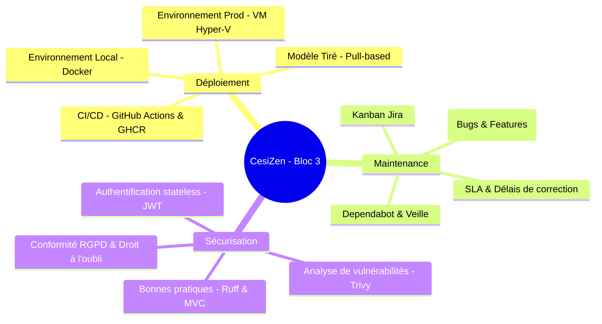

# Rapport d'Évaluation de Bloc 3 - CesiZen 🧘‍♂️
**Domaine : Déployer et sécuriser les applications informatiques**

Ce document analyse la réalisation technique du projet **CesiZen** au regard de la grille d'évaluation officielle du **Bloc 3** du titre **Concepteur Développeur d'Applications (CDA)**. Il sert de base de rédaction pour votre dossier écrit (15-20 pages) et de support de préparation pour votre soutenance orale (20 minutes).

---

## 📊 Synthèse Globale du Projet par Rapport à la Grille



---

## 📁 I. LE DÉPLOIEMENT (Noté sur 10 points)

### 1. Mise en place des environnements de déploiement (2 pts)
Vous devez démontrer la séparation et la cohérence de vos environnements :

* **Environnement de Développement (Local)** :
  * **Outil** : Orchestré entièrement avec `docker-compose.yml` (multi-services).
  * **Fonctionnement** : Montage de volumes locaux (`./backend/cesi_zen_api:/app`) permettant le *Hot-Reloading* (rechargement à chaud du code lors des modifications) sans reconstruire les images. Utilisation d'une base PostgreSQL locale et d'un fallback SQLite automatique pour les tests unitaires.
* **Environnement de Production (VM)** :
  * **Outil** : Machine virtuelle isolée sous **Hyper-V** (Ubuntu 24.04/26.04 LTS), simulant un cloud d'hébergement.
  * **Optimisation mémoire** : Configuration d'un **SWAP de 4 Go** (espace d'échange sur disque) pour fiabiliser la VM de 8 Go et empêcher l'OOM Killer de Linux de tuer brutalement les démons (comme `sshd` ou `postgres`).
  * **Dépannage système** : Résolution du bug de signature UEFI (Secure Boot) au démarrage de Hyper-V et installation manuelle du plugin CLI `docker-compose-plugin` (V2).

### 2. Plan de déploiement (6 pts)
Le plan de déploiement doit être structuré, standardisé et reproductible par un tiers :

* **Les livrables rédigés** :
  * **[docs/vm_initialisation.md](docs/vm_initialisation.md)** : Guide technique décrivant la création de la VM (Génération 2, RAM, configuration réseau commutateur par défaut), les options d'installation d'Ubuntu Server, la configuration du fichier `.ssh/config` hôte, l'installation des paquets requis et du SWAP.
  * **[docs/pra_procedure.md](docs/pra_procedure.md)** : Plan de Reprise d'Activité (PRA) complet. Il documente le transfert sécurisé des fichiers de configuration (`scp`), la connexion au registre d'images GitHub (GHCR), le démarrage de la stack (`make up`), la restauration de la base de données (Postgres SQL ou migration SQLite), et les étapes post-déploiement.
* **Architecture Pull-Based (Modèle Tiré)** :
  * Justifiez ce choix en soutenance : la VM télécharge (*pull*) les images précompilées depuis GitHub Actions. Cela évite d'ouvrir des flux réseau entrants critiques sur la VM de production, renforçant grandement la sécurité.

### 3. Proposition et configuration d'un outil de versioning (2 pts)
* **Versioning des sources** : Hébergé sur **GitHub** avec une stratégie de branches stricte :
  * `main` : Code de production stable. Déclenche la CD de Production.
  * `develop` : Code d'intégration en développement. Déclenche la CD de Développement.
  * `feature/*` : Branches de fonctionnalités (ex: `feature/vm-deployment`).
* **Résolution de bug technique Windows/Git (Casse)** :
  * Expliquez comment vous avez résolu le blocage de casse de branche sous Windows (chemin de dossier local `.git/refs/heads/Feature/` créé avec majuscule bloquant la création de branches en minuscules `feature/*`). Résolu en renommant temporairement la branche locale, puis en poussant vers une référence distante explicite :
    `git push -u origin HEAD:refs/heads/feature/vm-deployment`
* **Registre de paquets** : Utilisation de **GitHub Container Registry (GHCR)** pour versionner les images conteneurisées (`backend` et `frontend`) avec authentification sécurisée par Token (PAT).

---

## 🛠️ II. LA MAINTENANCE ET L'ÉVOLUTIVITÉ (Noté sur 9 points)

### 1. Outil de gestion des évolutions et corrections (6 pts)
Vous devez prouver l'intégration d'un cycle de gestion des incidents et demandes de fonctionnalités :

* **Intégration directe dans l'application mobile (Ionic)** :
  * **Onglet Contact & Support** : Intégration dans la page des paramètres [settings.page.html](CesiZenMobile/src/app/pages/settings/settings.page.html) de deux boutons d'action reliés à votre espace Jira :
    1. *Signaler un bug* : Ouvre un formulaire Jira ciblé pour qualifier l'anomalie.
    2. *Suggérer une évolution* : Ouvre un formulaire Jira dédié aux nouvelles fonctionnalités.
* **Gestion côté Équipe Projet / Administration (Back-office)** :
  * **Plateforme Jira Software** : Centralisation complète de la gestion des incidents (bugs) et des demandes d'évolutions.
  * **Tableau Kanban Jira** : Suivi agile de l'avancement des tickets (To Do, In Progress, In Review, Done).
  * **Intégration et ouverture utilisateur** : Grâce aux deux liens de formulaires directs Jira intégrés dans l'application mobile, n'importe quel utilisateur ou testeur peut créer un ticket qualifié sans intermédiaire, alimentant directement le backlog Jira.
* **Délais de support (SLA)** :
  * Vous devez présenter le tableau des délais d'intervention exigés par le Ministère (de 1h pour un incident bloquant critique à 40h de correction pour un incident mineur).

### 2. Garanties d'évolutivité de la solution - Veille et méthodologie (3 pts)
* **Automatisation de la veille** : Configuration de **Dependabot** (`.github/dependabot.yml`) pour scanner chaque semaine les dépendances Python (`pip`) et Angular/Ionic (`npm`), et ouvrir automatiquement des Pull Requests de mise à jour en cas de faille ou d'obsolescence.
* **Architecture modulaire (Docker + Clean Code)** :
  * L'usage de microservices séparés (Database, API Django, Nginx Web server) garantit qu'un module peut évoluer ou être remplacé sans impacter les autres.
  * Le code Angular/Ionic utilise le découpage en composants autonomes (*standalone*) facilitant la réutilisation.

---

## 🔒 III. LA SÉCURISATION (Noté sur 11 points)

### 1. Plan de sécurisation - Risques, vulnérabilités et cryptage (8 pts)
* **Scan de vulnérabilités en CI/CD** :
  * Intégration de **Trivy Scanner** dans les pipelines GitHub Actions. Il scanne le système de fichiers (`fs`) à la recherche de dépendances vulnérables ou de secrets exposés à chaque commit.
* **Gestion des secrets** :
  * Aucun mot de passe ni clé secrète n'est écrit en dur dans le code. 
  * Utilisation d'un fichier **`.env`** externalisé chargé au démarrage par Docker. 
  * Création d'une commande `make secret` dans le `Makefile` exploitant le module Python sécurisé `secrets` pour générer des clés cryptographiquement robustes.
* **Suppression de SessionAuthentication (Sécurité API)** :
  * Résolution de l'erreur `CSRF token missing` en retirant `SessionAuthentication` de DRF. L'API utilise désormais uniquement une authentification sans état (**Stateless JWT**) via `JWTAuthentication` et `BasicAuthentication`, ce qui est la bonne pratique pour les applications mobiles hybrides. Le CSRF reste actif sur le panneau `/admin` via le middleware de session Django.
* **Chiffrement des flux** : Recommandation de configurer un reverse-proxy HTTPS (via Nginx ou Let's Encrypt) sur le port 443 pour crypter les échanges entre le client mobile et le serveur.

### 2. Données personnelles et conformité RGPD (2 pts)
Le projet CesiZen traitant de la santé mentale, la conformité RGPD est critique :

* **Consentement à l'inscription** : Case à cocher obligatoire acceptant le traitement des données lors de la création de compte sur `user.page.html`.
* **Transparence** : Onglet **Confidentialité & RGPD** dans les paramètres expliquant exactement le traitement des données (aucune donnée d'exercice enregistrée, données d'émotions strictement personnelles).
* **Droit à l'oubli** : Bouton **"Supprimer mon compte"** dans les paramètres qui appelle l'API de suppression du backend Django, nettoyant immédiatement et définitivement toutes les données de l'utilisateur de la base PostgreSQL.

### 3. Bonnes pratiques de développement (1 pt)
* **Linter & Formatter** : Configuration de **Ruff** dans la CI backend pour valider le respect des standards PEP 8 et éliminer le code mort.
* **Validation de type** : Utilisation d'ESLint pour le frontend Angular/TypeScript.
* **Tests Automatisés** : Lancement automatique de la suite de tests unitaires Django à chaque push dans la CI.

---

## 📝 IV. Préparation de la Soutenance (4 points)

Lors de votre présentation de 20 minutes devant le jury, structurez votre discours autour de ces démonstrations clés :

```
[00:00 - 05:00] : Présentation du projet CesiZen, de l'architecture MVC et Docker.
[05:00 - 10:00] : Démonstration du Plan de Reprise d'Activité (PRA) et de l'initialisation VM.
[10:00 - 15:00] : Sécurité & RGPD (Démonstration du Droit à l'oubli et du scan Trivy en CI).
[15:00 - 20:00] : Maintenance corrective (Scénario d'un bug ouvert sur Jira, corrigé sur develop, et déployé sur la VM via "make pull && make restart").
```

> [!TIP]
> **Le point fort de votre soutenance :** 
> Insistez sur le fait que la VM est configurée avec du **SWAP** pour parer aux instabilités de RAM, et que vous avez résolu le bug de **CSRF** en adaptant l'authentification de l'API mobile vers du stateless **JWT**, prouvant ainsi votre maîtrise de la sécurisation des architectures mobiles/API.

---

## 🗃️ Annexe : Fiches Techniques & Liens de Référence (Pour Gemini)

*Cette section regroupe toutes les données brutes, chemins de fichiers, commandes exactes et URLs pour permettre à un autre modèle d'IA (ex: Gemini) de rédiger de manière exhaustive votre dossier écrit (15 à 20 pages).*

### 🔗 1. URLs et Intégrations Jira de l'Application

* **Formulaire Jira de Signalement de Bug** (Relié au bouton rouge "Signaler un bug" de l'onglet Contact) :
  `https://cesizenlgi.atlassian.net/jira/software/form/1ac51179-2bd3-49c3-944b-c0ce0fbbb1dd?atlOrigin=eyJpIjoiNDIzODk2ZjJjMDY2NDAwZmI5NTJlOGE4NTI5MGFiNmQiLCJwIjoiaiJ9`
* **Formulaire Jira de Demande de Feature/Évolution** (Relié au bouton bleu "Suggérer une évolution" de l'onglet Contact) :
  `https://cesizenlgi.atlassian.net/jira/software/form/ea98ea68-0ef2-4787-91ca-a14d9e2e0768?atlOrigin=eyJpIjoiZTE3NGIzNmY4MmQ3NDYzMmI0OWM1MDc3NTI2NTJkYTciLCJwIjoiaiJ9`
* **Intégration Mobile (Frontend)** :
  * Fichier HTML : `CesiZenMobile/src/app/pages/settings/settings.page.html` (onglet de contact accordéon).
  * Fichier TypeScript : `CesiZenMobile/src/app/pages/settings/settings.page.ts` (méthodes `reportBug()` et `requestFeature()`).

### ⚙️ 2. Fichiers et Chemins Importants du Projet

* **Architecture Docker & Déploiement** :
  * Fichier Compose de production : `docker-compose.yml` (orchestre `db` avec Postgres 16 Alpine, `backend` avec Django/uv, `frontend` avec Angular/Ionic/Nginx).
  * Fichier Compose de développement : `.tools/docker-compose.yml` (similaire mais monté avec rechargement à chaud et variables d'environnement locales).
  * Variables d'environnement de production : `.tools/.env` (externalise `SECRET_KEY`, `DEBUG`, `POSTGRES_DB`, etc.).
  * Script d'automatisation des commandes : `.tools/Makefile` (commandes standardisées `make up`, `make down`, `make pull`, `make secret`).
* **Serveur Web & Reverse Proxy** :
  * Fichier de configuration Nginx : `CesiZenMobile/nginx.conf` (gère le routage vers l'API Django `/api/`, le panneau `/admin/`, le service des fichiers statiques `/static/` et redirige le trafic Angular sur le port 80).
* **Workflows CI/CD (GitHub Actions)** :
  * Intégration Continue (Backend) : `.github/workflows/ci-backend.yml` (Linter Ruff ➡️ Tests Django sur SQLite ➡️ Scanner de sécurité Trivy ➡️ Check de Build image).
  * Intégration Continue (Frontend) : `.github/workflows/ci-frontend.yml` (Linter ESLint ➡️ Scanner de sécurité Trivy ➡️ Check de Build image).
  * Déploiement Continu (Dev) : `.github/workflows/cd-dev.yml` (Pousse l'image `:develop` sur GHCR à chaque push sur `develop`).
  * Déploiement Continu (Prod) : `.github/workflows/cd-prod.yml` (Pousse les images `:latest` et `:short-sha` sur GHCR et notifie la VM pour le pull de prod).
  * Veille automatisée : `.github/dependabot.yml` (Mises à jour automatiques hebdomadaires de `pip` et `npm`).

### 💻 3. Commandes d'Administration Git & Base de Données

* **Résolution du conflit de casse de branche (Windows/Git)** :
  * Renommer localement en temporaire pour contourner l'insensibilité à la casse de Windows :
    `git branch -m Feature/vm-deployment-tmp`
  * Renommer dans la bonne casse locale :
    `git branch -m Feature/vm-deployment`
  * Forcer la branche distante en minuscules sur GitHub :
    `git push -u origin HEAD:refs/heads/feature/vm-deployment`
* **Migration de Base de Données (SQLite de dev -> PostgreSQL de VM)** :
  * Exportation en préservant les clés naturelles (sans exporter `contenttypes` ni `auth.Permission`) :
    `docker compose exec -e USE_POSTGRES=False backend uv run python manage.py dumpdata --natural-foreign --natural-primary -e contenttypes -e auth.Permission --indent 4 > dump.json`
  * Importation de la base dans PostgreSQL en production :
    `docker compose exec -i backend uv run python manage.py loaddata dump.json`

### 🔧 4. Résolutions de Bugs de Sécurité Majeurs

* **Correction CSRF FAILED (Mobile / API)** :
  * **Problème** : L'utilisation de sessions HTTP sur une application mobile causait un blocage CSRF systématique lors des requêtes d'inscription/connexion.
  * **Solution** : Retrait de `SessionAuthentication` du backend Django dans `backend/cesi_zen_api/config/settings.py` au profit de `JWTAuthentication` (SimpleJWT). L'API devient entièrement sans état (stateless) via jetons JWT cryptographiques.
* **Sécurisation de la RAM de la VM Hyper-V** :
  * **Problème** : Crashs et blocages réguliers des démons systèmes en production en cas de pic de charge Docker (OOM Killer de Linux).
  * **Solution** : Configuration d'un SWAP permanent de 4 Go sur la VM Ubuntu via :
    `sudo fallocate -l 4G /swapfile && sudo chmod 600 /swapfile && sudo mkswap /swapfile && sudo swapon /swapfile` (et persistance dans `/etc/fstab`).

### 🕒 5. Grille de Sévérité et Délais SLA de Maintenance

| Priorité de l'Incident | Sévérité de l'Incident | Prise en Compte / Diagnostic | Correction & Résolution |
| :--- | :--- | :--- | :--- |
| **Critique** | Bloquant (Service inutilisable sans contournement possible) | **< 1 heure ouvrée** | **< 3 heures ouvrées** |
| **Forte** | Bloquant (Service altéré ou contournement partiel existant) | **< 2 heures ouvrées** | **< 6 heures ouvrées** |
| **Moyenne** | Majeur (Dysfonctionnement partiel de fonctionnalités secondaires) | **< 7 heures ouvrées** | **< 16 heures ouvrées** |
| **Faible** | Mineur (Altération visuelle ou bug cosmétique simple) | **< 1 jour ouvré** | **< 40 heures ouvrées** |

